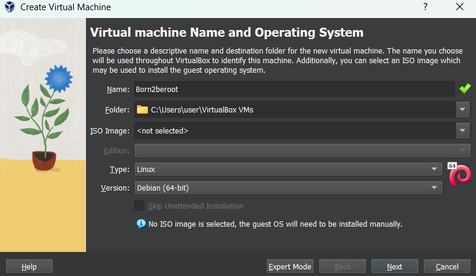

# **Introduction**


## **What is a virtual machine?**

- A Virtual Machine (VM) is a compute resource that uses software instead of a physical computer to run programs and deploy apps. One or more virtual “guest” machines run on a physical “host” machine. Each virtual machine runs its own operating system and functions separately from the other VMs, even when they are all running on the same host.

## **Creating new virtual machine using virtual box**

1. first we open virtual box and we click new



2. now we specify the amount of RAM (Random Access Memory) we want

3. then we specify the storage we want for this virtual machine

4. now we click settings, and we specify the OS we want


5. we can start the virtual machine now and we click install

## **Installing Debian**

- In Linux, a hostname is a human-readable label assigned to a computer or server to identify it within a network.

- root password is the password we put to get the root access (to be a root user)

- user password is the password i put when i log in

## **What is Partitioning**

- Partitioning in Linux is the process of dividing a physical storage drive (like an SSD or HDD) into logical sections, or partitions, allowing each section to function like a separate disk for organizing data, running multiple operating systems (dual-boot), or separating system files from user data for better management, security, and easier backups. Each partition can then be formatted with a specific file system (like ext4 or Btrfs) and mounted to a directory (mount point) for access.

1. first we click Manual to divide the hard disk into partitions

- In Linux, sda is the name of a storage device (a disk), not a partition itself.

- Partitions are numbered:
    - sda1 -> first partition on disk sda
    - sda2 -> second partition
    - sda3 -> third partition

- Example:

```
/dev/sda
├── /dev/sda1
├── /dev/sda2
└── /dev/sda3
```

- difference between primary and logical partitions:

- A primary partition is a main partition on a disk

- A logical partition lives inside an extended partition

```
sda1  (primary)
sda2  (primary)
sda3  (extended)
 ├── sda5 (logical)
 ├── sda6 (logical)
 └── sda7 (logical)
```

- What is the meaning of ext4?

- ext4 means Fourth Extended Filesystem.
- A filesystem defines how data is stored, organized, and retrieved on a partition.

- What is the meaning of mount point?

- A mount point is a folder that represents a disk or partition in the Linux directory tree.

| Mount point | Meaning                       |
| ----------- | ----------------------------- |
| `/`         | Root filesystem (main system) |
| `/home`     | User files                    |
| `/boot`     | Bootloader files              |
| `/var`      | Logs, databases               |

